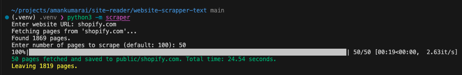

### Simple Python Website Knowledge Base

Enter your website name, and the knowledge base will be created for you.

## How to use

1. Clone the repository
```
git clone git@github.com:onlyoneaman/website-scrapper-text.git
```

2. Install the requirements
```
pip install -r requirements.txt
```

3. Run the script
```
python web_scrapper.py
```

4. Enter the website name
```
Enter website URL: https://www.example.com
Enter number of pages (default: 3): 100
```



5. The knowledge base will be created in the `public` folder with your website name.


